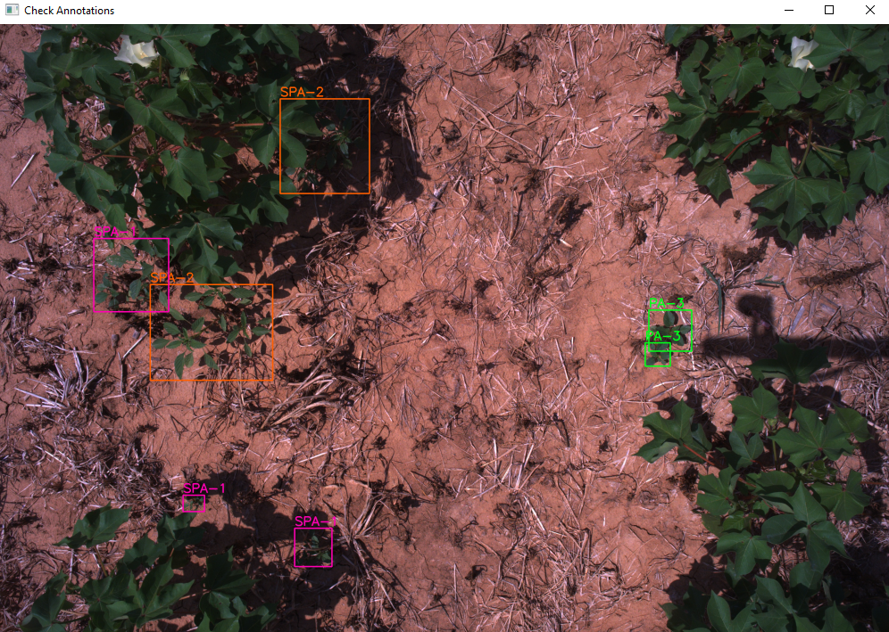
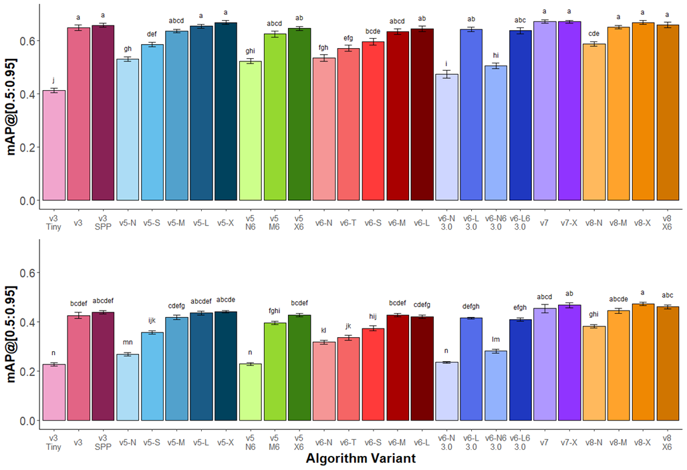
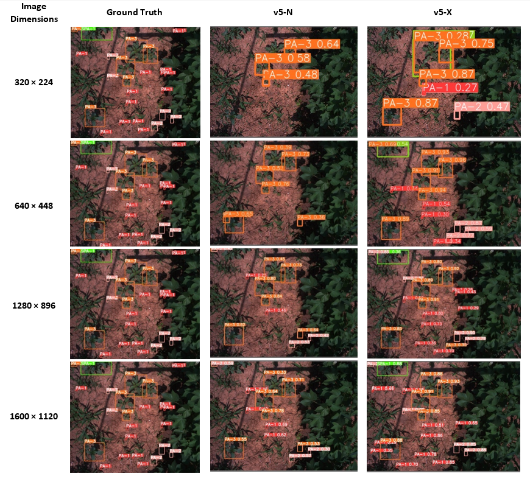

# Multi growth-stage detection of Palmer amaranth in cotton
Repository for Palmer amaranth detection in cotton at different growth stages. It accompanies the preprint: 
**Multi-growth stage plant recognition: a case study of Palmer amaranth (Amaranthus palmeri) in cotton 
(Gossypium hirsutum)** available on [arXiv](https://arxiv.org/abs/2307.15816). Please consider citing this preprint 
if you use the work in your research.

### Set up the repository
Model training is completed using Google Colab, and as such image and annotation data needs to be stored on your 
Google Drive. Follow the steps below to set up the data and repository for replication of the training procedure used.

### Clone the repository 
Clone the repository into your Google Drive by mounting Drive, navigating to it and running:
```
git clone https://github.com/geezacoleman/Palmer-detection palmer-amaranth
```

### Download and unzip image files
Download the complete dataset from [Weed-AI]() and unzip the images into the `data/images` directory.

### Splits and folds
Organise the data into respective splits and folds using the splits in `data/splits` and the labels for each class 
grouping under `data/labels_GROUP`. Make sure you are in the `palmer-amaranth` directory within your Google Drive first.
Run the utility function:

```
python setup_dataset.py --data-dir 'data' --output-dir 'datasets'
```
Change the flags to your custom locations as needed. The defaults will function correctly from the root directory of this 
repository.

### Check Annotations
A tool to check annotations for YOLO and PASCAL VOC (XML) format has been developed. Using `utils.py`, simply provide 
the path to the image and labels directory and the class names.
```python
if __name__ == "__main__":
    classes = ['PA-1', 'PA-2', 'PA-3', 'PA-4', 'PA-5', 'SPA-1', 'SPA-2', 'SPA-3']

    visualise(label_dir='data/xml',
              images_dir=r'data/images',
              classes=classes)
```
Update these variables as necessary.


<p align="center">
     
     <br>Screenshot of the annotation checker. Use 'space' to move to the next image and 'esc' to exit. 
</p>

```
python setup_dataset.py
```
This may take some time as it copies the dataset five times into respective folds and splits.

# Results
### Colab notebooks
Once you have finished setting the repository up, you are ready to start training models. Model training was conducted 
using Google Colab Pro+. All training notebooks are available below.

| YOLO version | Google Colab Link                                                                                                                                                                                                                   |
|--------------|-------------------------------------------------------------------------------------------------------------------------------------------------------------------------------------------------------------------------------------|
| v3           | <a target="_blank" href="https://colab.research.google.com/github/geezacoleman/Palmer-detection/blob/main/colab/pa_yolov3.ipynb">  </a>    |
| v5           | <a target="_blank" href="https://colab.research.google.com/github/geezacoleman/Palmer-detection/blob/main/colab/pa_yolov5.ipynb">  </a>    |
| v6           | <a target="_blank" href="https://colab.research.google.com/github/geezacoleman/Palmer-detection/blob/main/colab/pa_yolov6.ipynb">  </a>    |
| v6 3.0       | <a target="_blank" href="https://colab.research.google.com/github/geezacoleman/Palmer-detection/blob/main/colab/pa_yolov6-v2.ipynb">  </a> |
| v7           | <a target="_blank" href="https://colab.research.google.com/github/geezacoleman/Palmer-detection/blob/main/colab/pa_yolov7.ipynb">  </a>    |
| v8           | <a target="_blank" href="https://colab.research.google.com/github/geezacoleman/Palmer-detection/blob/main/colab/pa_yolov8.ipynb">  </a>    |

### Comparison of YOLO variants
   
<p align="center">
     
     <br> Figure 2 growth stage recognition performance of Amaranthus palmeri across YOLO versions and variants 
trained on a single (top) class and all eight (bottom) classes. Variants within the same YOLO version are indicated by 
similar colors. The largest variants within each series performed similarly. Standard error (n=5) of the mean is 
provided as error bars. Tukey’s HSD lettering indicates significance (P < 0.05) between different variants within the single or eight class 
</p>

### Growth stage, image size and performance
<p align="center">
     
     <br>Figure 7 Illustration of growth stage detection at the four resolutions tested for the ground truth (left), 
v5-X, and v5-N model variants. At lower resolutions, the difference between the smaller and larger model becomes apparent. 
</p>

### Eigen-CAM
<a target="_blank" href="https://colab.research.google.com/github/geezacoleman/Palmer-detection/blob/main/eigen-cam/eigen-cam.ipynb">  </a> 


# Cite
Please cite our work as:
```json
@misc{coleman2023multigrowth,
      title={Multi-growth stage plant recognition: a case study of Palmer amaranth (Amaranthus palmeri) in cotton (Gossypium hirsutum)}, 
      author={Guy RY Coleman and Matthew Kutugata and Michael J Walsh and Muthukumar Bagavathiannan},
      year={2023},
      eprint={2307.15816},
      archivePrefix={arXiv},
      primaryClass={cs.CV}
}
```

# References
This research made use of the open-source, YOLO family of object detection models. Repository clones made at the time the research was conducted
are provided here for replication purposes. Only minor modifications have been made to the code. Please credit the original authors of these
repositories listed below:

1. [YOLOv3](https://github.com/ultralytics/yolov3)
2. [YOLOv5](https://github.com/ultralytics/yolov5)
3. [YOLOv6](https://github.com/meituan/YOLOv6)
4. [YOLOv7](https://github.com/WongKinYiu/yolov7)
5. [YOLOv8](https://github.com/ultralytics/ultralytics)
